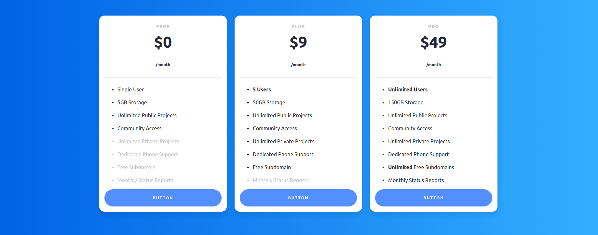
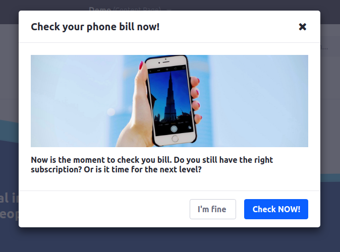
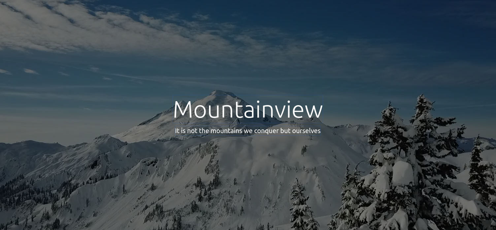
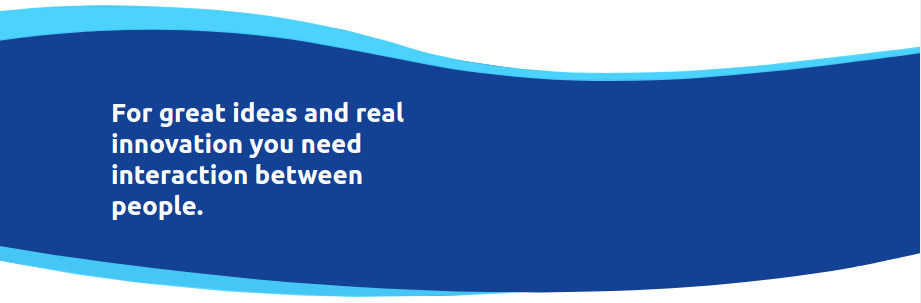

# Global-Fragments

This project has been created with [generator-liferay-fragments][1]. You can read
how to manage this project in the [generator documentation][2].

[1]: https://www.npmjs.com/package/generator-liferay-fragments
[2]: https://www.npmjs.com/package/generator-liferay-fragments#usage

sudo npm run compress

## Banner only
Sometimes you just want to show a banner without any Title, text or CTA. It automatically adjusts to the full width.

## Pricing plan
An example of a pricing plan where you can change prices and names.

## Modal
To show a modal on top of the page. You can adjust the title, bodytext and buttons.

## Video header
Movevement always attracts the eye. This will show a video and you can adjust the title and subtitle.

## Waves
To show a more fluid approach when presenting text. You can modify the quote.

